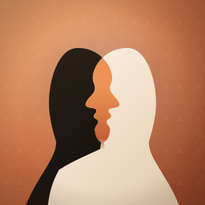

# AMAWELE AI Clone — app icon



*Amawele* means **twins**. The mark is two profile busts, mirrored and overlapped,
so the shared area between them resolves into a single luminous face — two people,
one identity. Read at a glance it is one portrait; read again it is two.

## Files

| File | Use |
| --- | --- |
| `amawele-icon.svg` | Vector master, 1024×1024 viewBox. Edit this, never the PNGs. |
| `amawele-icon-1024.png` | App Store / Play Store upload. Flat RGB, square, no alpha. |
| `amawele-icon-512.png`, `-256.png`, `-180.png`, `-120.png`, `-60.png` | Common iOS / Android / web slots. |
| `amawele-icon-rounded-1024.png` | Squircle-masked preview for mockups and decks. Not for store upload. |
| `build_icons.py` | Regenerates every PNG from the SVG. |

Store uploads must stay square with hard corners — the platform applies its own
mask. The rounded file exists only so the icon can be shown the way it will look
on a home screen.

## Palette

| Role | Value |
| --- | --- |
| Background, light | `#EFA873` |
| Background, mid (terracotta) | `#C96F45` |
| Background, deep clay | `#8C4025` |
| Shared face, top | `#EE9256` |
| Shared face, base | `#C25E38` |
| Beige figure | `#FDF4E8` → `#E6CFB2` |
| Black figure | `#2C2219` → `#12100D` |
| Pattern overlay | `#F8EBD9` at 11% |

A bogolan-inspired motif — zigzag rows, dots, triangles — sits over the
background at low opacity. It should read as texture, not as decoration; if it
becomes legible as a pattern at icon size, it is too strong.

## Regenerating

```bash
pip install cairosvg pillow
python assets/brand/build_icons.py
```

Verify any edit at 60 px and 40 px before committing. The silhouette separation
and the terracotta core are what carry the mark at those sizes; everything else
is allowed to disappear.
